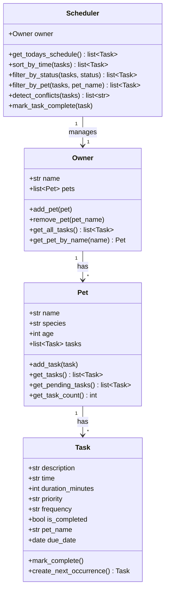

# PawPal+ System Architecture - UML Diagram

## Class Responsibilities:

**Task**: Represents a single pet care activity
- Stores all details about the task (what, when, how long, priority)
- Can mark itself complete and generate recurring instances

**Pet**: Represents a pet with their care tasks
- Holds pet information and their task list
- Provides access to tasks and task counts

**Owner**: Represents the pet owner managing multiple pets
- Contains all pets and provides aggregate access to tasks
- Central data store for the system

**Scheduler**: The "brain" that organizes and manages tasks
- Sorts, filters, and detects conflicts in the schedule
- Provides the main scheduling intelligence
